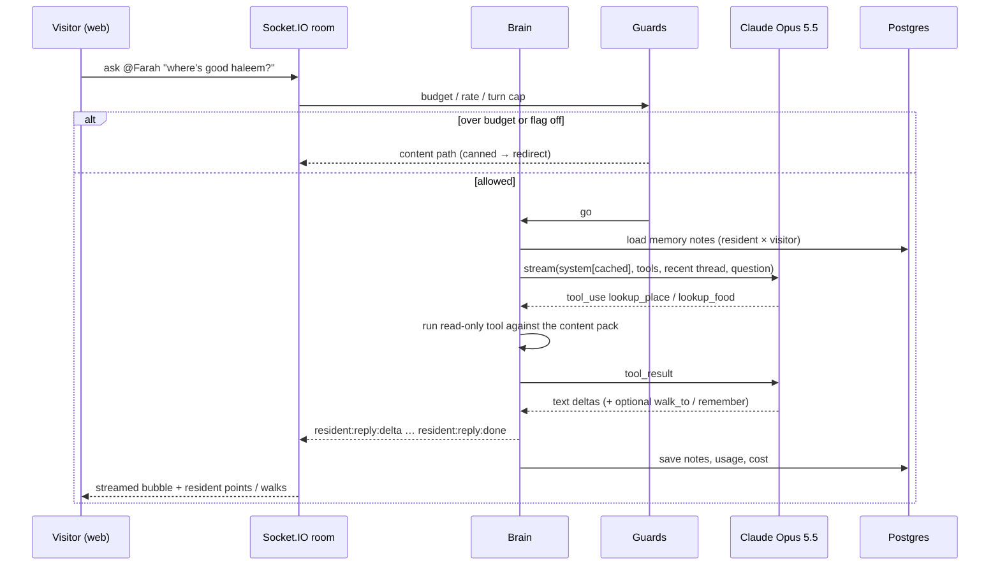
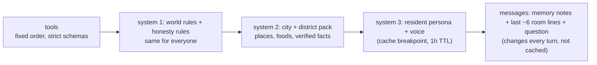
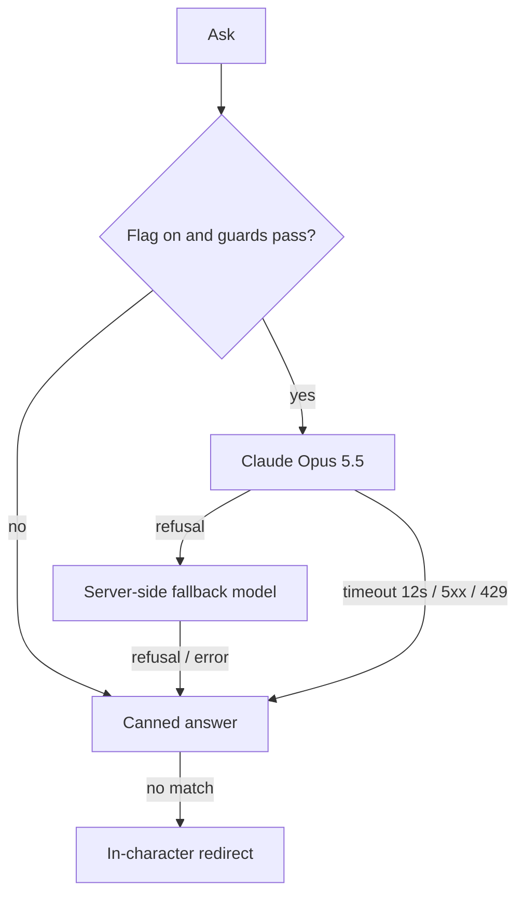

# Phase 2 — Resident Brain (plan, for approval)

Status: **proposal**. Nothing here is built yet. Decisions marked **[you]** need an answer before work starts.

## Why this is Phase 2

- `apps/server/src/brain/answer.ts` already reserves it: *"P2 puts Claude Opus 5.5 in front of this (streaming, tools, memory) and keeps this path as the fallback."*
- Phase 1 gave residents real streets, real doors and real local time. Today they still answer from a canned bank or an in-character redirect.
- The moat is residents who **know their block, remember you, and act in the world**, not a chat box next to a 3D scene. Every later feature (voice, live events, visiting agents) goes through this brain.

## Scope

| In P2 | Later (P3+) |
|---|---|
| Streaming, in-character answers from Claude Opus 5.5 | Voice in/out |
| Grounded in the content pack through read-only tools | Residents starting conversations and running routines on their own |
| Per-visitor memory ("you asked about biryani last time") | Street-level imagery / video at venues |
| World actions: point at, walk you to, recommend nearby | Visitor-owned agents living in the city (legacy `skill.md` / bot registry) |
| Spend caps, fallback ladder, eval set, feature flag | Multi-resident scenes (two residents talking) |

## One turn, end to end

## Prompt layout (built for caching)

Order is `tools → system → messages`; caching is a prefix match, so everything stable goes first.

- One cache entry per resident; district packs are shared by that district's residents.
- No timestamps or IDs in `system`. Local time and weather go in the user turn.
- Check `usage.cache_read_input_tokens` in tests; if it's 0 on the second turn, something is invalidating the prefix.
- Each ask is a **fresh request**: the recent thread is rendered as text in the user turn, and earlier assistant turns are not replayed. That keeps the prefix stable and avoids Opus 5.5's thinking-block replay rules across turns. Inside one turn's tool loop, blocks are passed back unchanged.

## Model settings

| Setting | Value | Why |
|---|---|---|
| Model | `claude-opus-5-5` | Already the legacy default; $4 / $20 per M tokens, cache read $0.20 |
| Effort | `low` (set explicitly) | Chatty, short replies. The model default is `medium`. Thinking can't be turned off on 5.5, so effort is the only control |
| `max_tokens` | ~2,000, streamed | Replies are 1–4 sentences; leaves room for thinking |
| `tool_choice` | `auto` + `strict: true` tools | Forced tool choice returns 400 on 5.5 |
| Refusals | server-side `fallbacks: "default"`; check `stop_reason` | A final refusal drops to the content path, never an empty bubble |
| Tool loop | max 3 rounds per turn | Bounds latency and cost |

## Tools

| Tool | Kind | Notes |
|---|---|---|
| `lookup_place`, `lookup_food`, `lookup_event` | read | From the content pack; returns placement (`real` / `approximate`) so the resident can hedge |
| `lookup_fact` | read | Returns **only** facts with a source or a verified flag; others come back marked "unverified" |
| `nearby(radius)` | read | Real distances and walking ETA from district geometry |
| `point_at(placeId)`, `walk_to(placeId)` | world action | Server validates, then broadcasts to the room. This is the "agentic" part people see |
| `remember(note)` | write | ≤140 chars; resident × visitor; the visitor can see and delete their notes in *Me* |

No web access in P2: residents speak from curated content. That's a deliberate trade for accuracy and cost.

## Fallback ladder

## Cost (estimate; measure in the eval run)

| Per turn | Tokens | Cost |
|---|---|---|
| Cached prefix read | ~6,000 | $0.0012 |
| Uncached input (memory + thread + question + tool results) | ~1,500 | $0.0060 |
| Output incl. low-effort thinking | ~600 | $0.0120 |
| **Total** | | **≈ $0.02** |

- The legacy default budget of **$2/day ≈ 100 answers a day** across all visitors. That's a demo budget, not a product budget. **[you]** Pick the daily cap.
- Guards ported from `server/llm/costGuards.js`: global daily $ cap, per-visitor turns per hour, per-room concurrency of 1 stream per resident.
- Every turn logs tokens, cache hits and dollars. Admin line on `/v1/health`.

## Safety and trust

- **Visitor text is untrusted.** It only ever goes in the user turn, never in `system`. Tools are read-only except `remember` / `walk_to` / `point_at`, which the server validates.
- **Replies are public** (the room sees them), so run output through a short blocklist and length cap before broadcasting.
- Residents are clearly labelled as AI characters (already in the footer and onboarding). Keep that on every reply bubble.
- **Blocker found in this audit:** `content:validate` reports `factsVerified 0` and `factsWithSources 0`. Today that's harmless because facts are only shown as canned text. With Claude, residents will state them confidently to strangers. **Verify and source the 75 facts, or keep unverified ones out of `lookup_fact`, before the flag goes on.**

## Evals before rollout

- About 60 prompts across 7 cities: grounded questions, trick questions (made-up dishes and places), off-topic questions, prompt-injection attempts, repeat-visitor memory checks.
- Graded on: grounded (no invented places or facts), stays in character, correct hedging on `approximate` places, reply ≤ 4 sentences.
- Gate: no regressions against the content path on grounded questions, and cost per turn ≤ the estimate +50%.

## Delivery slices (each one PR, each shippable)

1. **Plumbing**: `@anthropic-ai/sdk`, brain interface, flag `BRAIN=content|claude` (default `content`), guards port, usage table, streaming socket events in `packages/contracts`. No model calls in CI (mocked client).
2. **Grounded answers**: cached prompt layout, read tools, fallback ladder, eval harness plus the first eval run with its measured cost.
3. **Memory**: `remember` tool, memory table, "What residents remember about you" in *Me* with delete.
4. **World actions**: `point_at` / `walk_to`, animated in the scene, narrated for screen readers.
5. **Rollout**: flag on for a share of sessions, watch cost and reports, then default on.

## Decisions for you

1. **[you] Daily spend cap** for the live demo ($2 today ≈ 100 answers).
2. **[you] Facts**: verify and source the 75 facts first (slower, honest), or exclude unverified facts from what residents may state (fast, residents know less)?
3. **[you] Memory retention**: how long notes last (suggest 30 days, visitor-deletable).
4. **[you]** Confirm P3 is voice plus residents taking the initiative, or reorder toward video / real-world imagery.
